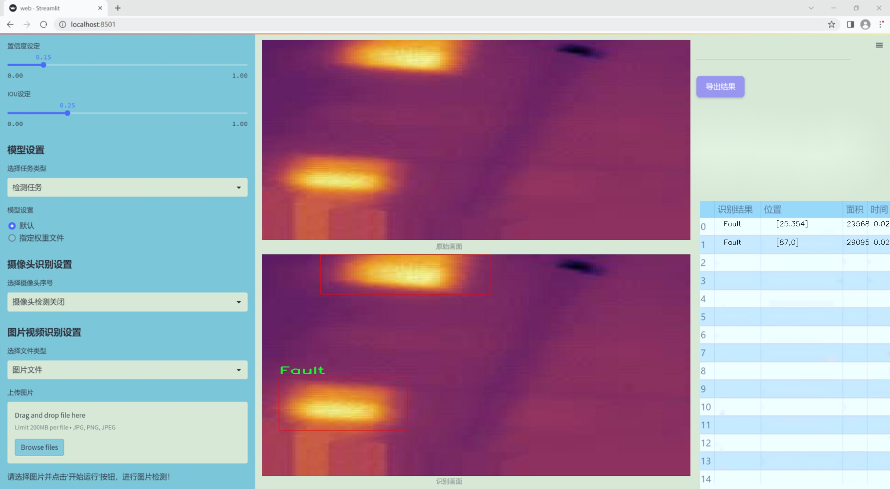
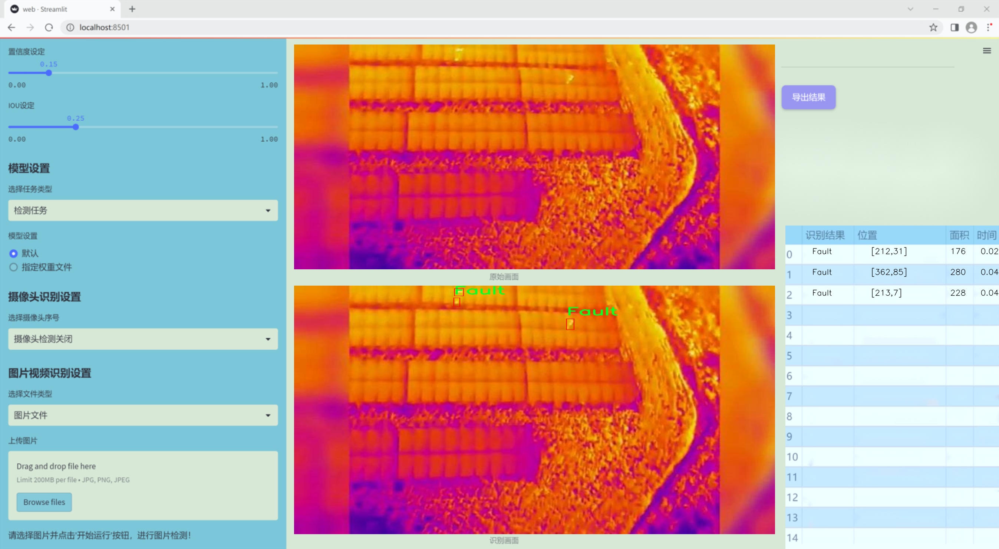
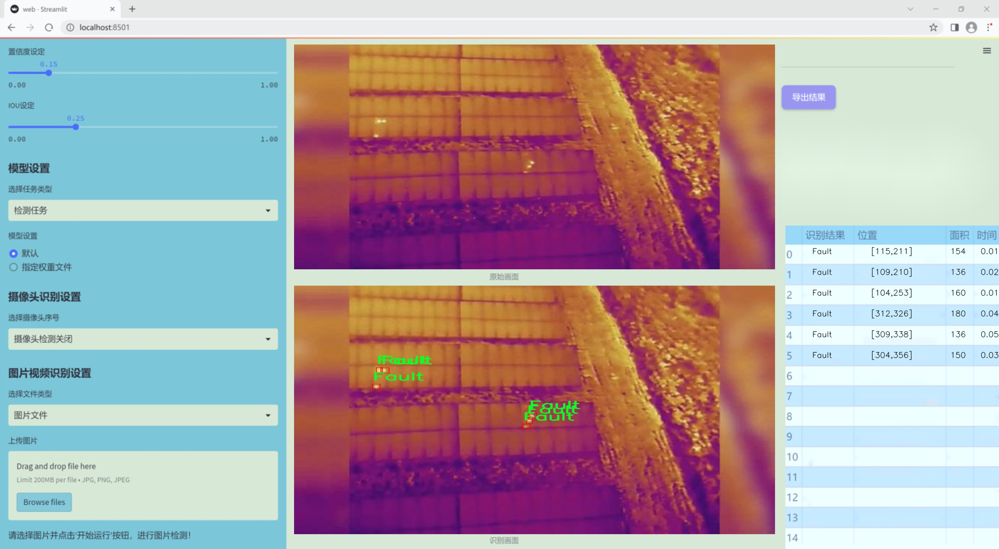
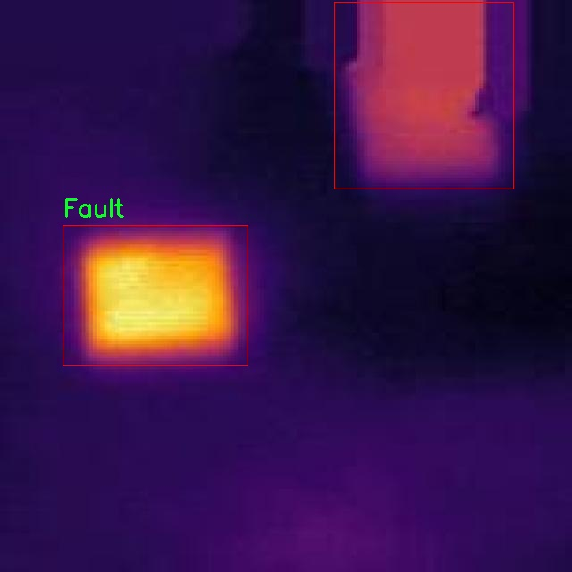
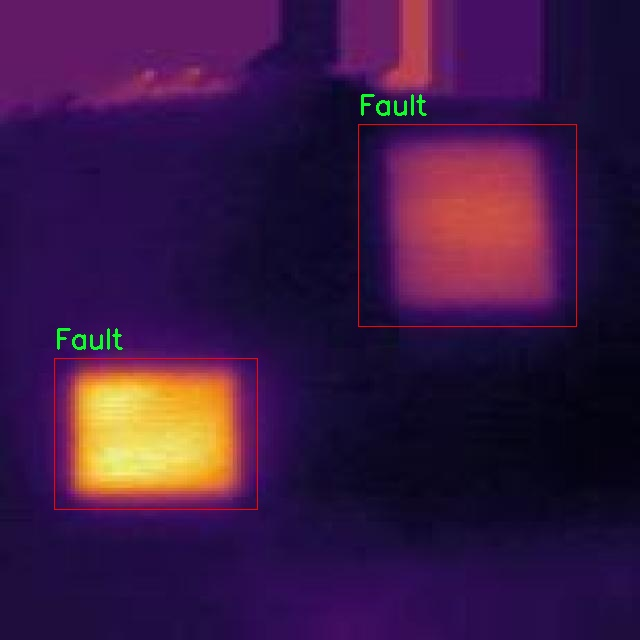
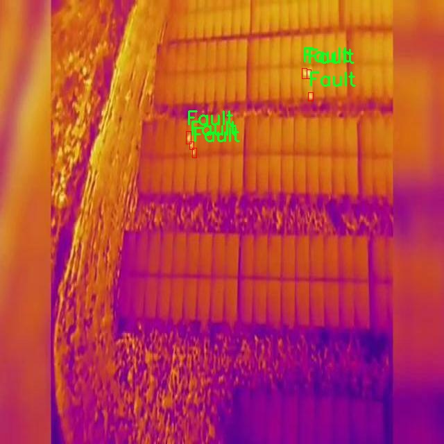
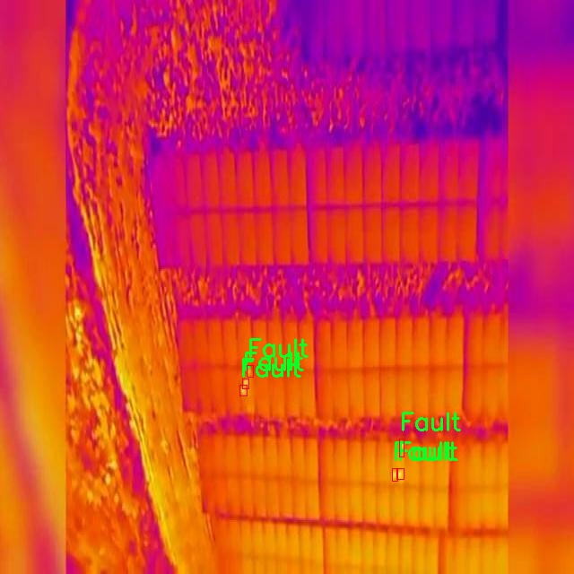
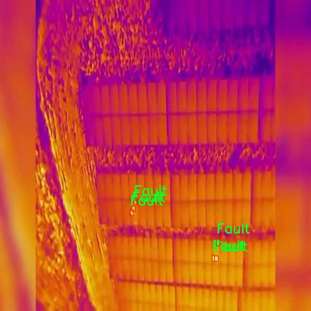

### 1.背景意义

研究背景与意义

随着全球对可再生能源的关注日益增强，太阳能作为一种清洁、可持续的能源形式，得到了广泛应用。然而，太阳能板在长期使用过程中，可能会出现各种故障，如表面裂纹、污垢积聚或连接不良等，这些问题不仅影响了太阳能板的发电效率，还可能导致设备的提前损坏。因此，及时、准确地检测太阳能板的故障，对于保障太阳能发电系统的高效运行至关重要。

传统的故障检测方法多依赖人工检查，这不仅耗时耗力，而且容易受到人为因素的影响，导致漏检或误检的情况发生。随着计算机视觉技术的迅速发展，基于深度学习的自动化故障检测系统逐渐成为研究的热点。YOLO（You Only Look Once）系列模型因其高效的实时检测能力，成为了目标检测领域的主流选择。特别是YOLOv11模型，凭借其在精度和速度上的优越表现，适合用于复杂环境下的太阳能板故障检测。

本研究旨在基于改进的YOLOv11模型，构建一个高效的太阳能板故障检测系统。我们将使用一个包含1020张标注图像的数据集，该数据集专注于故障类别，能够为模型的训练提供丰富的样本。通过对数据集的精细处理和模型的优化，我们期望提高故障检测的准确性和实时性，从而为太阳能发电行业提供一个可靠的技术支持。这不仅能够降低运维成本，还能提升太阳能发电系统的整体效率，推动可再生能源的可持续发展。

### 2.视频效果

[2.1 视频效果](https://www.bilibili.com/video/BV1xGBrY8EvA/)

### 3.图片效果







##### [项目涉及的源码数据来源链接](https://kdocs.cn/l/cszuIiCKVNis)**

注意：本项目提供训练的数据集和训练教程,由于版本持续更新,暂不提供权重文件（best.pt）,请按照6.训练教程进行训练后实现上图演示的效果。

### 4.数据集信息

##### 4.1 本项目数据集类别数＆类别名

nc: 1
names: ['Fault']


该项目为【目标检测】数据集，请在【训练教程和Web端加载模型教程（第三步）】这一步的时候按照【目标检测】部分的教程来训练

##### 4.2 本项目数据集信息介绍

本项目数据集信息介绍

本项目旨在改进YOLOv11的太阳能板故障检测系统，因此我们构建了一个专门针对太阳能板故障的高质量数据集。该数据集的主题为“SolarPanel”，专注于识别和检测太阳能板在实际应用中可能出现的故障情况。数据集中包含的类别数量为1，具体类别为“Fault”，这意味着数据集的主要目标是帮助模型准确识别和分类太阳能板的故障状态。

为了确保数据集的有效性和实用性，我们收集了来自不同环境和条件下的太阳能板图像。这些图像不仅涵盖了各种类型的故障，例如裂纹、污垢、老化和连接问题等，还包括正常工作状态的太阳能板图像，以便于模型在训练过程中能够更好地学习到故障与正常状态之间的区别。数据集中的图像均经过精心标注，确保每个故障实例都能被准确识别，从而为模型提供可靠的训练基础。

此外，数据集的图像来源多样，涵盖了不同的光照条件、天气情况和拍摄角度，旨在增强模型的鲁棒性和泛化能力。通过这种方式，我们希望训练出的YOLOv11模型能够在实际应用中表现出色，能够快速、准确地检测出太阳能板的故障，从而为太阳能发电系统的维护和管理提供有力支持。

综上所述，本项目的数据集不仅为YOLOv11的训练提供了丰富的样本和标注信息，也为后续的故障检测研究奠定了坚实的基础。我们相信，通过对该数据集的有效利用，能够显著提升太阳能板故障检测的准确性和效率，为可再生能源的可持续发展贡献一份力量。











### 5.全套项目环境部署视频教程（零基础手把手教学）

[5.1 所需软件PyCharm和Anaconda安装教程（第一步）](https://www.bilibili.com/video/BV1BoC1YCEKi/?spm_id_from=333.999.0.0&vd_source=bc9aec86d164b67a7004b996143742dc)


[5.2 安装Python虚拟环境创建和依赖库安装视频教程（第二步）](https://www.bilibili.com/video/BV1ZoC1YCEBw?spm_id_from=333.788.videopod.sections&vd_source=bc9aec86d164b67a7004b996143742dc)

### 6.改进YOLOv11训练教程和Web_UI前端加载模型教程（零基础手把手教学）

[6.1 改进YOLOv11训练教程和Web_UI前端加载模型教程（第三步）](https://www.bilibili.com/video/BV1BoC1YCEhR?spm_id_from=333.788.videopod.sections&vd_source=bc9aec86d164b67a7004b996143742dc)


按照上面的训练视频教程链接加载项目提供的数据集，运行train.py即可开始训练



     Epoch   gpu_mem       box       obj       cls    labels  img_size
     1/200     20.8G   0.01576   0.01955  0.007536        22      1280: 100%|██████████| 849/849 [14:42<00:00,  1.04s/it]
               Class     Images     Labels          P          R     mAP@.5 mAP@.5:.95: 100%|██████████| 213/213 [01:14<00:00,  2.87it/s]
                 all       3395      17314      0.994      0.957      0.0957      0.0843

     Epoch   gpu_mem       box       obj       cls    labels  img_size
     2/200     20.8G   0.01578   0.01923  0.007006        22      1280: 100%|██████████| 849/849 [14:44<00:00,  1.04s/it]
               Class     Images     Labels          P          R     mAP@.5 mAP@.5:.95: 100%|██████████| 213/213 [01:12<00:00,  2.95it/s]
                 all       3395      17314      0.996      0.956      0.0957      0.0845

     Epoch   gpu_mem       box       obj       cls    labels  img_size
     3/200     20.8G   0.01561    0.0191  0.006895        27      1280: 100%|██████████| 849/849 [10:56<00:00,  1.29it/s]
               Class     Images     Labels          P          R     mAP@.5 mAP@.5:.95: 100%|███████   | 187/213 [00:52<00:00,  4.04it/s]
                 all       3395      17314      0.996      0.957      0.0957      0.0845


###### [项目数据集下载链接](https://kdocs.cn/l/cszuIiCKVNis)

### 7.原始YOLOv11算法讲解


###### YOLOv11改进方向

与YOLOv 10相比，YOLOv 11有了巨大的改进，包括但不限于：

  * 增强的模型结构：模型具有改进的模型结构，以获取图像处理并形成预测
  * GPU优化：这是现代ML模型的反映，GPU训练ML模型在速度和准确性上都更好。
  * 速度：YOLOv 11模型现在经过增强和GPU优化以用于训练。通过优化，这些模型比它们的前版本快得多。在速度上达到了25%的延迟减少！
  * 更少的参数：更少的参数允许更快的模型，但v11的准确性不受影响
  * 更具适应性：更多支持的任务YOLOv 11支持多种类型的任务、多种类型的对象和多种类型的图像。

###### YOLOv11功能介绍

Glenn Jocher和他的团队制作了一个令人敬畏的YOLOv 11迭代，并且在图像人工智能的各个方面都提供了YOLO。YOLOv 11有多种型号，包括：

  * 对象检测-在训练时检测图像中的对象
  * 图像分割-超越对象检测，分割出图像中的对象
  * 姿态检测-当用点和线训练时绘制一个人的姿势
  * 定向检测（OBB）：类似于对象检测，但包围盒可以旋转
  * 图像分类-在训练时对图像进行分类

使用Ultralytics Library，这些模型还可以进行优化，以：

  * 跟踪-可以跟踪对象的路径
  * 易于导出-库可以以不同的格式和目的导出
  * 多场景-您可以针对不同的对象和图像训练模型

此外，Ultralytics还推出了YOLOv 11的企业模型，该模型将于10月31日发布。这将与开源的YOLOv
11模型并行，但将拥有更大的专有Ultralytics数据集。YOLOv 11是“建立在过去的成功”的其他版本的之上。

###### YOLOv11模型介绍

YOLOv 11附带了边界框模型（无后缀），实例分割（-seg），姿态估计（-pose），定向边界框（-obb）和分类（-cls）。

这些也有不同的尺寸：纳米（n），小（s），中（m），大（l），超大（x）。


YOLOv11模型

###### YOLOv11与前版本对比

与YOLOv10和YOLOv8相比，YOLOv11在Ultralytics的任何帖子中都没有直接提到。所以我会收集所有的数据来比较它们。感谢Ultralytics：

**检测：**


YOLOv11检测统计


YOLOv10检测统计

其中，Nano的mAPval在v11上为39.5，v10上为38.5；Small为47.0 vs 46.3，Medium为51.5 vs
51.1，Large为53.4 vs 53.2，Extra Large为54.7vs
54.4。现在，这可能看起来像是一种增量增加，但小小数的增加可能会对ML模型产生很大影响。总体而言，YOLOv11以0.3
mAPval的优势追平或击败YOLOv10。

现在，我们必须看看速度。在延迟方面，Nano在v11上为1.55 , v10上为1.84，Small为2.46 v2.49，Medium为4.70
v4.74，Large为6.16 v7.28，Extra Large为11.31
v10.70。延迟越低越好。YOLOv11提供了一个非常低的延迟相比，除了特大做得相当差的前身。

总的来说，Nano模型是令人振奋的，速度更快，性能相当。Extra Large在性能上有很好的提升，但它的延迟非常糟糕。

**分割：**


YOLOV11 分割统计


YOLOV9 分割统计


YOLOV8 分割数据

总体而言，YOLOv 11上的分割模型在大型和超大型模型方面比上一代YOLOv 8和YOLOv 9做得更好。

YOLOv 9 Segmentation没有提供任何关于延迟的统计数据。比较YOLOv 11延迟和YOLOv 8延迟，发现YOLOv 11比YOLOv
8快得多。YOLOv 11将大量GPU集成到他们的模型中，因此期望他们的模型甚至比CPU测试的基准更快！

姿态估计：


YOLOV11姿态估计统计


YOLOV8姿态估计统计

YOLOv 11的mAP 50 -95统计量也逐渐优于先前的YOLOv 8（除大型外）。然而，在速度方面，YOLOv
11姿势可以最大限度地减少延迟。其中一些延迟指标是版本的1/4！通过对这些模型进行GPU训练优化，我可以看到指标比显示的要好得多。

**定向边界框：**


YOLOv11 OBB统计


YOLOv8 OBB统计

OBB统计数据在mAP
50上并不是很好，只有非常小的改进，在某种程度上小于检测中的微小改进。然而，从v8到v11的速度减半，这表明YOLOv11在速度上做了很多努力。

**最后，分类：**


YOLOv 11 CLS统计


YOLOv8 CLS统计

从v8到v11，准确性也有了微小的提高。然而，速度大幅上升，CPU速度更快的型号。


### 8.200+种全套改进YOLOV11创新点原理讲解

#### 8.1 200+种全套改进YOLOV11创新点原理讲解大全

由于篇幅限制，每个创新点的具体原理讲解就不全部展开，具体见下列网址中的改进模块对应项目的技术原理博客网址【Blog】（创新点均为模块化搭建，原理适配YOLOv5~YOLOv11等各种版本）

[改进模块技术原理博客【Blog】网址链接](https://gitee.com/qunmasj/good)


#### 8.2 精选部分改进YOLOV11创新点原理讲解

###### 这里节选部分改进创新点展开原理讲解(完整的改进原理见上图和[改进模块技术原理博客链接](https://gitee.com/qunmasj/good)【如果此小节的图加载失败可以通过CSDN或者Github搜索该博客的标题访问原始博客，原始博客图片显示正常】


### 感受野注意力卷积（RFAConv)
#### 标准卷积操作回顾
标准的卷积操作是构造卷积神经网络的基本构件。它利用具有共享参数的滑动窗口提取特征信息，克服了全连通层构造神经网络固有的参数多、计算开销大的问题。设 X R∈C×H×W
表示输入特征图，其中C、H、W分别表示特征图的通道数、高度、宽度。为了清楚地演示卷积核的特征提取过程，我们使用 C = 1 的例子。从每个接受域滑块中提取特征信息的卷积运算可以表示为:


这里，Fi 表示计算后每个卷积滑块得到的值，Xi 表示每个滑块内对应位置的像素值，K表示卷积核，S表示卷积核中的参数个数，N表示接收域滑块的总数。可以看出，每个滑块内相同位置的 feature共享相同的参数Ki。因此，标准的卷积运算并不能捕捉到不同位置所带来的信息差异，这最终在一定程度上限制了卷积神经网络的性能。 

#### 空间注意力回顾
目前，空间注意机制是利用学习得到的注意图来突出每个特征的重要性。与前一节类似，这里以 C=1为例。突出关键特征的空间注意机制可以简单表述为:这里，Fi 表示加权运算后得到的值。xi 和Ai 表示输入特征图和学习到的注意图在不同位置的值，N为输入特征图的高和宽的乘积，表示像素值的总数。


#### 空间注意与标准卷积运算
将注意力机制整合到卷积神经网络中，可以提高卷积神经网络的性能。通过对标准卷积运算和现有空间注意机制的研究，我们认为空间注意机制有效地克服了卷积神经网络固有的参数共享的局限性。目前卷积神经网络中最常用的核大小是 1 × 1和3 × 3。在引入空间注意机制后，提取特征的卷积操作可以是 1 × 1或3 × 3卷积操作。为了直观地展示这个过程，在 1 × 1卷积运算的前面插入了空间注意机制。通过注意图对输入特征图(Re-weight“×”)进行加权运算，最后通过 1 × 1卷积运算提取接收域的滑块特征信息。整个过程可以简单地表示如下:


 这里卷积核K仅代表一个参数值。如果取A i× ki 的值作为一种新的卷积核参数，有趣的是它解决了 1×1卷积运算提取特征时的参数共享问题。然而，关于空间注意机制的传说到此结束。当空间注意机制被插入到3×3卷积运算前面时。具体情况如下:


如上所述，如果取A的值 i × ki (4)式作为一种新的卷积核参数，完全解决了大规模卷积核的参数共享问题。然而，最重要的一点是，卷积核在提取每个接受域滑块的特征时，会共享一些特征。换句话说，每个接收域滑块内都有一个重叠。仔细分析后会发现A12= a21， a13 = a22， a15 = a24……，在这种情况下，每个滑动窗口共享空间注意力地图的权重。因此，空间注意机制没有考虑整个接受域的空间特征，不能有效地解决大规模卷积核的参数共享问题。因此，空间注意机制的有效性受到限制。 

#### 创新空间注意力和标准卷积操作
该博客提出解决了现有空间注意机制的局限性，为空间处理提供了一种创新的解决方案。受RFA的启发，一系列空间注意机制被开发出来，可以进一步提高卷积神经网络的性能。RFA可以看作是一个轻量级即插即用模块，RFA设计的卷积运算(RFAConv)可以代替标准卷积来提高卷积神经网络的性能。因此，我们预测空间注意机制与标准卷积运算的结合将继续发展，并在未来带来新的突破。
接受域空间特征:为了更好地理解接受域空间特征的概念，我们将提供相关的定义。接收域空间特征是专门为卷积核设计的，并根据核大小动态生成。如图1所示，以3×3卷积核为例。在图1中，“Spatial Feature”指的是原始的Feature map。“接受域空间特征”是空间特征变换后的特征图。

 

由不重叠的滑动窗口组成。当使用 3×3卷积内核提取特征时，接收域空间特征中的每个 3×3大小窗口代表一个接收域滑块。接受域注意卷积(RFAConv):针对接受域的空间特征，我们提出了接受域注意卷积(RFA)。该方法不仅强调了接收域滑块内不同特征的重要性，而且对接收域空间特征进行了优先排序。通过该方法，完全解决了卷积核参数共享的问题。接受域空间特征是根据卷积核的大小动态生成的，因此，RFA是卷积的固定组合，不能与卷积操作的帮助分离，卷积操作同时依赖于RFA来提高性能，因此我们提出了接受场注意卷积(RFAConv)。具有3×3大小的卷积核的RFAConv整体结构如图所示。


目前，最广泛使用的接受域特征提取方法是缓慢的。经过大量的研究，我们开发了一种快速的方法，用分组卷积来代替原来的方法。具体来说，我们利用相应大小的分组卷积来动态生成基于接受域大小的展开特征。尽管与原始的无参数方法(如PyTorch提供的nn.())相比，该方法增加了一些参数，但它的速度要快得多。注意:如前一节所述，当使用 3×3卷积内核提取特征时，接收域空间特征中的每个 3×3大小窗口表示一个接收域滑块。而利用快速分组卷积提取感受野特征后，将原始特征映射为新的特征。最近的研究表明。交互信息可以提高网络性能，如[40,41,42]所示。同样，对于RFAConv来说，通过交互接受域特征信息来学习注意图可以提高网络性能。然而，与每个接收域特征交互会导致额外的计算开销，因此为了最小化计算开销和参数的数量，我们使用AvgPool来聚合每个接收域特征的全局信息。然后，使用 1×1 组卷积操作进行信息交互。最后，我们使用softmax来强调每个特征在接受域特征中的重要性。一般情况下，RFA的计算可以表示为:


这里gi×i 表示一个大小为 i×i的分组卷积，k表示卷积核的大小，Norm表示归一化，X表示输入的特征图，F由注意图 a相乘得到 rf 与转换后的接受域空间特征 Frf。与CBAM和CA不同，RFA能够为每个接受域特征生成注意图。卷积神经网络的性能受到标准卷积操作的限制，因为卷积操作依赖于共享参数，对位置变化带来的信息差异不敏感。然而，RFAConv通过强调接收域滑块中不同特征的重要性，并对接收域空间特征进行优先级排序，可以完全解决这个问题。通过RFA得到的feature map是接受域空间特征，在“Adjust Shape”后没有重叠。因此，学习到的注意图将每个接受域滑块的特征信息聚合起来。换句话说，注意力地图不再共享在每个接受域滑块。这完全弥补了现有 CA和CBAM注意机制的不足。RFA为标准卷积内核提供了显著的好处。而在调整形状后，特征的高度和宽度是 k倍，需要进行 stride = k的k × k卷积运算来提取特征信息。RFA设计的卷积运算RFAConv为卷积带来了良好的增益，对标准卷积进行了创新。
此外，我们认为现有的空间注意机制应该优先考虑接受域空间特征，以提高网络性能。众所周知，基于自注意机制的网络模型[43,44,45]取得了很大的成功，因为它解决了卷积参数共享的问题，并对远程信息进行建模。然而，自注意机制也为模型引入了显著的计算开销和复杂性。我们认为，将现有的空间注意机制的注意力引导到接受场空间特征上，可以以类似于自我注意的方式解决长期信息的参数共享和建模问题。与自我关注相比，这种方法需要的参数和计算资源少得多。答案如下:(1)将以接收场空间特征为中心的空间注意机制与卷积相结合，消除了卷积参数共享的问题。(2)现有的空间注意机制已经考虑了远程信息，可以通过全局平均池或全局最大池的方式获取全局信息，其中明确考虑了远程信息。因此，我们设计了新的 CBAM和CA模型，称为RFCBAM和RFCA，它们专注于接受域空间特征。与RFA类似，使用最终的k × k stride = k 的卷积运算来提取特征信息。这两种新的卷积方法的具体结构如图 3所示，我们称这两种新的卷积操作为 RFCBAMConv和RFCAConv。与原来的CBAM相比，我们在RFCBAM中使用SE attention来代替CAM。因为这样可以减少计算开销。此外，在RFCBAM中，通道注意和空间注意不是分开执行的。相反，它们是同时加权的，使得每个通道获得的注意力地图是不同的。


### 9.系统功能展示

图9.1.系统支持检测结果表格显示

  图9.2.系统支持置信度和IOU阈值手动调节

  图9.3.系统支持自定义加载权重文件best.pt(需要你通过步骤5中训练获得)

  图9.4.系统支持摄像头实时识别

  图9.5.系统支持图片识别

  图9.6.系统支持视频识别

  图9.7.系统支持识别结果文件自动保存

  图9.8.系统支持Excel导出检测结果数据


### 10. YOLOv11核心改进源码讲解

#### 10.1 rep_block.py

以下是对代码中最核心部分的提取和详细中文注释。主要集中在 `DiverseBranchBlock` 类及其相关的功能函数上。

```python
import torch
import torch.nn as nn
import torch.nn.functional as F

# 定义核心模块
class DiverseBranchBlock(nn.Module):
    def __init__(self, in_channels, out_channels, kernel_size,
                 stride=1, padding=None, dilation=1, groups=1,
                 internal_channels_1x1_3x3=None,
                 deploy=False, single_init=False):
        super(DiverseBranchBlock, self).__init__()
        self.deploy = deploy  # 是否处于部署模式

        self.kernel_size = kernel_size  # 卷积核大小
        self.in_channels = in_channels  # 输入通道数
        self.out_channels = out_channels  # 输出通道数
        self.groups = groups  # 分组卷积的组数
        
        # 自动计算填充
        if padding is None:
            padding = (kernel_size - 1) // 2  # 默认填充为卷积核大小的一半
        assert padding == kernel_size // 2

        # 如果处于部署模式，直接使用卷积层
        if deploy:
            self.dbb_reparam = nn.Conv2d(in_channels=in_channels, out_channels=out_channels, kernel_size=kernel_size, stride=stride,
                                      padding=padding, dilation=dilation, groups=groups, bias=True)
        else:
            # 定义原始卷积和批归一化层
            self.dbb_origin = self.conv_bn(in_channels, out_channels, kernel_size, stride, padding, dilation, groups)

            # 定义平均池化和批归一化层
            self.dbb_avg = nn.Sequential()
            if groups < out_channels:
                self.dbb_avg.add_module('conv',
                                        nn.Conv2d(in_channels=in_channels, out_channels=out_channels, kernel_size=1,
                                                  stride=1, padding=0, groups=groups, bias=False))
                self.dbb_avg.add_module('bn', nn.BatchNorm2d(out_channels))
                self.dbb_avg.add_module('avg', nn.AvgPool2d(kernel_size=kernel_size, stride=stride, padding=0))
                self.dbb_1x1 = self.conv_bn(in_channels, out_channels, kernel_size=1, stride=stride,
                                       padding=0, groups=groups)
            else:
                self.dbb_avg.add_module('avg', nn.AvgPool2d(kernel_size=kernel_size, stride=stride, padding=padding))
            self.dbb_avg.add_module('avgbn', nn.BatchNorm2d(out_channels))

            # 定义1x1和kxk卷积层
            if internal_channels_1x1_3x3 is None:
                internal_channels_1x1_3x3 = in_channels if groups < out_channels else 2 * in_channels

            self.dbb_1x1_kxk = nn.Sequential()
            if internal_channels_1x1_3x3 == in_channels:
                self.dbb_1x1_kxk.add_module('idconv1', IdentityBasedConv1x1(channels=in_channels, groups=groups))
            else:
                self.dbb_1x1_kxk.add_module('conv1', nn.Conv2d(in_channels=in_channels, out_channels=internal_channels_1x1_3x3,
                                                            kernel_size=1, stride=1, padding=0, groups=groups, bias=False))
            self.dbb_1x1_kxk.add_module('bn1', nn.BatchNorm2d(internal_channels_1x1_3x3))
            self.dbb_1x1_kxk.add_module('conv2', nn.Conv2d(in_channels=internal_channels_1x1_3x3, out_channels=out_channels,
                                                            kernel_size=kernel_size, stride=stride, padding=0, groups=groups, bias=False))
            self.dbb_1x1_kxk.add_module('bn2', nn.BatchNorm2d(out_channels))

        if single_init:
            self.single_init()  # 单一初始化

    def conv_bn(self, in_channels, out_channels, kernel_size, stride=1, padding=0, dilation=1, groups=1):
        """创建卷积层和批归一化层的组合"""
        conv_layer = nn.Conv2d(in_channels=in_channels, out_channels=out_channels, kernel_size=kernel_size,
                                stride=stride, padding=padding, dilation=dilation, groups=groups,
                                bias=False)
        bn_layer = nn.BatchNorm2d(num_features=out_channels, affine=True)
        return nn.Sequential(conv_layer, bn_layer)

    def get_equivalent_kernel_bias(self):
        """获取等效的卷积核和偏置"""
        k_origin, b_origin = self.transI_fusebn(self.dbb_origin[0].weight, self.dbb_origin[1])

        # 处理1x1卷积
        if hasattr(self, 'dbb_1x1'):
            k_1x1, b_1x1 = self.transI_fusebn(self.dbb_1x1[0].weight, self.dbb_1x1[1])
        else:
            k_1x1, b_1x1 = 0, 0

        # 处理kxk卷积
        k_1x1_kxk_first, b_1x1_kxk_first = self.transI_fusebn(self.dbb_1x1_kxk[0].weight, self.dbb_1x1_kxk[1])
        k_avg = self.transV_avg(self.out_channels, self.kernel_size, self.groups)

        return self.transII_addbranch((k_origin, k_1x1, k_1x1_kxk_first), (b_origin, b_1x1, b_1x1_kxk_first))

    def forward(self, inputs):
        """前向传播"""
        if hasattr(self, 'dbb_reparam'):
            return self.dbb_reparam(inputs)

        out = self.dbb_origin(inputs)
        if hasattr(self, 'dbb_1x1'):
            out += self.dbb_1x1(inputs)
        out += self.dbb_avg(inputs)
        out += self.dbb_1x1_kxk(inputs)
        return out

    def transI_fusebn(self, kernel, bn):
        """融合卷积核和批归一化参数"""
        gamma = bn.weight
        std = (bn.running_var + bn.eps).sqrt()
        return kernel * ((gamma / std).reshape(-1, 1, 1, 1)), bn.bias - bn.running_mean * gamma / std

    def transII_addbranch(self, kernels, biases):
        """将多个卷积核和偏置相加"""
        return sum(kernels), sum(biases)

    def transV_avg(self, channels, kernel_size, groups):
        """生成平均卷积核"""
        input_dim = channels // groups
        k = torch.zeros((channels, input_dim, kernel_size, kernel_size))
        k[np.arange(channels), np.tile(np.arange(input_dim), groups), :, :] = 1.0 / kernel_size ** 2
        return k

    def single_init(self):
        """单一初始化方法"""
        self.init_gamma(0.0)
        if hasattr(self, "dbb_origin"):
            torch.nn.init.constant_(self.dbb_origin[1].weight, 1.0)

    def init_gamma(self, gamma_value):
        """初始化gamma值"""
        if hasattr(self, "dbb_origin"):
            torch.nn.init.constant_(self.dbb_origin[1].weight, gamma_value)
        if hasattr(self, "dbb_1x1"):
            torch.nn.init.constant_(self.dbb_1x1[1].weight, gamma_value)
        if hasattr(self, "dbb_avg"):
            torch.nn.init.constant_(self.dbb_avg[1].weight, gamma_value)
        if hasattr(self, "dbb_1x1_kxk"):
            torch.nn.init.constant_(self.dbb_1x1_kxk[1].weight, gamma_value)
```

### 代码说明
1. **DiverseBranchBlock 类**: 这是一个复杂的卷积模块，支持多种分支结构。它根据输入的通道数和输出的通道数，构建了多个卷积层和批归一化层。

2. **构造函数 `__init__`**: 初始化模块的各个部分，包括卷积层、批归一化层、平均池化层等。根据 `deploy` 参数决定是否使用重参数化卷积。

3. **`conv_bn` 方法**: 创建一个卷积层和一个批归一化层的组合，方便后续调用。

4. **`get_equivalent_kernel_bias` 方法**: 计算等效的卷积核和偏置，融合卷积和批归一化的参数。

5. **`forward` 方法**: 定义前向传播的计算过程，依次通过各个分支进行计算并相加。

6. **`transI_fusebn` 和 `transII_addbranch` 方法**: 处理卷积核和偏置的融合与相加，确保输出的正确性。

7. **`transV_avg` 方法**: 生成平均卷积核，用于处理不同的通道数。

8. **初始化方法**: 提供了单一初始化和 gamma 值的初始化方法，以便于模型训练的稳定性。

以上是对代码的核心部分的提取和详细注释，帮助理解其结构和功能。

该文件 `rep_block.py` 定义了一些用于构建神经网络的模块，主要是与卷积操作和批归一化（Batch Normalization）相关的自定义层。这些模块的设计目的是为了提高网络的表现力和灵活性，特别是在处理不同尺度和形状的输入时。

首先，文件中导入了必要的库，包括 PyTorch 的核心库和一些功能模块。接着，定义了一些用于卷积和批归一化的转换函数，这些函数用于将卷积核和偏置与批归一化层的参数结合起来，以便在推理阶段减少计算量。

在定义的类中，`IdentityBasedConv1x1` 是一个特殊的卷积层，它实现了 1x1 卷积，并在其权重中加入了一个恒等映射的张量，以保持输入的特征。这个设计可以帮助网络在进行卷积操作时保留原始特征。

`BNAndPadLayer` 类结合了批归一化和填充操作。它在批归一化后进行填充，以便在特征图的边缘保持一致性。这个类的设计使得在卷积操作后，输出的特征图在尺寸上能够保持一致。

`DiverseBranchBlock` 是一个复杂的模块，它结合了多个卷积路径。它的设计允许在同一层中使用不同的卷积核大小和结构，以捕捉输入特征的多样性。该模块支持多种初始化方式和部署模式，以适应不同的使用场景。

`DiverseBranchBlockNOAct` 和 `DeepDiverseBranchBlock` 类似于 `DiverseBranchBlock`，但前者不包含非线性激活函数，后者则允许使用不同的卷积结构来增强网络的深度和复杂性。

`WideDiverseBranchBlock` 是一个更为复杂的模块，它结合了水平和垂直卷积，允许网络在处理图像时捕捉到更丰富的特征。它的设计考虑了填充和裁剪，以确保输出特征图的尺寸与输入一致。

整体来看，这个文件提供了一些灵活且高效的卷积模块，旨在提升深度学习模型在处理图像等任务时的表现。这些模块通过不同的卷积结构和参数融合策略，使得网络能够在保持高效性的同时，增强其特征提取能力。

#### 10.2 SwinTransformer.py

以下是保留的核心代码部分，并添加了详细的中文注释：

```python
import torch
import torch.nn as nn
import torch.nn.functional as F
import numpy as np
from timm.models.layers import DropPath, to_2tuple, trunc_normal_

class Mlp(nn.Module):
    """ 多层感知机（MLP）模块。 """

    def __init__(self, in_features, hidden_features=None, out_features=None, act_layer=nn.GELU, drop=0.):
        super().__init__()
        out_features = out_features or in_features  # 输出特征数默认为输入特征数
        hidden_features = hidden_features or in_features  # 隐藏层特征数默认为输入特征数
        self.fc1 = nn.Linear(in_features, hidden_features)  # 第一层线性变换
        self.act = act_layer()  # 激活函数
        self.fc2 = nn.Linear(hidden_features, out_features)  # 第二层线性变换
        self.drop = nn.Dropout(drop)  # Dropout层

    def forward(self, x):
        """ 前向传播函数。 """
        x = self.fc1(x)  # 线性变换
        x = self.act(x)  # 激活
        x = self.drop(x)  # Dropout
        x = self.fc2(x)  # 线性变换
        x = self.drop(x)  # Dropout
        return x


class WindowAttention(nn.Module):
    """ 基于窗口的多头自注意力（W-MSA）模块。 """

    def __init__(self, dim, window_size, num_heads, qkv_bias=True, attn_drop=0., proj_drop=0.):
        super().__init__()
        self.dim = dim  # 输入通道数
        self.window_size = window_size  # 窗口大小
        self.num_heads = num_heads  # 注意力头数
        head_dim = dim // num_heads  # 每个头的维度
        self.scale = head_dim ** -0.5  # 缩放因子

        # 定义相对位置偏置参数表
        self.relative_position_bias_table = nn.Parameter(
            torch.zeros((2 * window_size[0] - 1) * (2 * window_size[1] - 1), num_heads))

        # 获取窗口内每个token的相对位置索引
        coords_h = torch.arange(self.window_size[0])
        coords_w = torch.arange(self.window_size[1])
        coords = torch.stack(torch.meshgrid([coords_h, coords_w]))  # 生成坐标网格
        coords_flatten = torch.flatten(coords, 1)  # 展平坐标
        relative_coords = coords_flatten[:, :, None] - coords_flatten[:, None, :]  # 计算相对坐标
        relative_coords = relative_coords.permute(1, 2, 0).contiguous()  # 重新排列维度
        relative_coords[:, :, 0] += self.window_size[0] - 1  # 偏移到从0开始
        relative_coords[:, :, 1] += self.window_size[1] - 1
        relative_coords[:, :, 0] *= 2 * self.window_size[1] - 1
        relative_position_index = relative_coords.sum(-1)  # 计算相对位置索引
        self.register_buffer("relative_position_index", relative_position_index)  # 注册为缓冲区

        self.qkv = nn.Linear(dim, dim * 3, bias=qkv_bias)  # 线性变换用于计算Q、K、V
        self.attn_drop = nn.Dropout(attn_drop)  # 注意力权重的Dropout
        self.proj = nn.Linear(dim, dim)  # 输出线性变换
        self.proj_drop = nn.Dropout(proj_drop)  # 输出的Dropout
        trunc_normal_(self.relative_position_bias_table, std=.02)  # 初始化相对位置偏置
        self.softmax = nn.Softmax(dim=-1)  # Softmax层

    def forward(self, x, mask=None):
        """ 前向传播函数。 """
        B_, N, C = x.shape  # 获取输入的形状
        qkv = self.qkv(x).reshape(B_, N, 3, self.num_heads, C // self.num_heads).permute(2, 0, 3, 1, 4)  # 计算Q、K、V
        q, k, v = qkv[0], qkv[1], qkv[2]  # 分离Q、K、V

        q = q * self.scale  # 缩放Q
        attn = (q @ k.transpose(-2, -1))  # 计算注意力得分

        # 添加相对位置偏置
        relative_position_bias = self.relative_position_bias_table[self.relative_position_index.view(-1)].view(
            self.window_size[0] * self.window_size[1], self.window_size[0] * self.window_size[1], -1)
        relative_position_bias = relative_position_bias.permute(2, 0, 1).contiguous()  # 重新排列维度
        attn = attn + relative_position_bias.unsqueeze(0)  # 加上相对位置偏置

        if mask is not None:
            attn = attn.view(B_ // mask.shape[0], mask.shape[0], self.num_heads, N, N) + mask.unsqueeze(1).unsqueeze(0)
            attn = attn.view(-1, self.num_heads, N, N)
            attn = self.softmax(attn)  # 应用Softmax
        else:
            attn = self.softmax(attn)

        attn = self.attn_drop(attn)  # Dropout

        x = (attn @ v).transpose(1, 2).reshape(B_, N, C)  # 计算输出
        x = self.proj(x)  # 线性变换
        x = self.proj_drop(x)  # Dropout
        return x


class SwinTransformer(nn.Module):
    """ Swin Transformer主干网络。 """

    def __init__(self, pretrain_img_size=224, patch_size=4, in_chans=3, embed_dim=96, depths=[2, 2, 6, 2],
                 num_heads=[3, 6, 12, 24], window_size=7, mlp_ratio=4., drop_rate=0., attn_drop_rate=0.,
                 drop_path_rate=0.2, norm_layer=nn.LayerNorm, ape=False, patch_norm=True, out_indices=(0, 1, 2, 3)):
        super().__init__()

        self.patch_embed = PatchEmbed(patch_size=patch_size, in_chans=in_chans, embed_dim=embed_dim)  # 图像分块嵌入
        self.pos_drop = nn.Dropout(p=drop_rate)  # Dropout层

        # 构建层
        self.layers = nn.ModuleList()
        for i_layer in range(len(depths)):
            layer = BasicLayer(
                dim=int(embed_dim * 2 ** i_layer),
                depth=depths[i_layer],
                num_heads=num_heads[i_layer],
                window_size=window_size,
                mlp_ratio=mlp_ratio,
                drop=drop_rate,
                attn_drop=attn_drop_rate,
                norm_layer=norm_layer)
            self.layers.append(layer)

    def forward(self, x):
        """ 前向传播函数。 """
        x = self.patch_embed(x)  # 图像分块嵌入
        x = self.pos_drop(x)  # Dropout

        outs = []
        for layer in self.layers:
            x_out, _, _, x, _, _ = layer(x)  # 通过每一层
            outs.append(x_out)  # 保存输出

        return outs  # 返回所有层的输出
```

### 代码说明
1. **Mlp类**：实现了一个多层感知机，包含两个线性层和激活函数，支持Dropout。
2. **WindowAttention类**：实现了窗口基础的多头自注意力机制，计算Q、K、V并应用相对位置偏置。
3. **SwinTransformer类**：构建了Swin Transformer的主干网络，包含图像分块嵌入和多个基本层，支持Dropout。

以上是Swin Transformer的核心结构，其他辅助函数和类可以根据需要添加。

这个程序文件实现了Swin Transformer模型的结构，Swin Transformer是一种基于视觉的Transformer架构，具有层次化的特性和移动窗口机制。程序中定义了多个类和函数，以构建模型的各个组件。

首先，程序导入了必要的库，包括PyTorch和一些辅助函数。接着定义了一个多层感知机（Mlp）类，它由两个线性层和一个激活函数（默认为GELU）组成，主要用于在Transformer的前馈网络中进行特征变换。

接下来，定义了两个函数`window_partition`和`window_reverse`，用于将输入特征分割成窗口和将窗口合并回原始特征。这是Swin Transformer的关键步骤，因为它通过窗口机制来计算局部自注意力。

然后，定义了`WindowAttention`类，它实现了基于窗口的多头自注意力机制。该类支持相对位置偏置，并且可以处理移动窗口（SW-MSA）和非移动窗口（W-MSA）。在前向传播中，输入特征经过线性变换生成查询、键和值，然后计算注意力权重，并应用相对位置偏置。

`SwinTransformerBlock`类实现了Swin Transformer的基本块，包含归一化层、窗口注意力层和前馈网络。它还支持循环移位，以便在计算注意力时使用不同的窗口。

`PatchMerging`类用于将特征图的补丁合并，以减少特征图的空间维度，并增加通道数。`BasicLayer`类则表示Swin Transformer的一个基本层，包含多个Swin Transformer块，并在最后可能包含一个下采样层。

`PatchEmbed`类负责将输入图像划分为补丁并进行嵌入。它使用卷积层将图像转换为补丁表示，并可选择性地应用归一化。

最后，`SwinTransformer`类是整个模型的主体，包含多个层和嵌入层。它可以处理输入图像并输出特征图，支持绝对位置嵌入和随机深度等功能。

程序还包含一个`update_weight`函数，用于加载预训练权重，并定义了一个`SwinTransformer_Tiny`函数，用于创建一个小型的Swin Transformer模型实例，并可选择性地加载权重。

整体来看，这个程序文件提供了Swin Transformer的完整实现，涵盖了模型的各个组成部分和功能，适合用于图像处理和计算机视觉任务。

#### 10.3 cfpt.py

以下是保留的核心代码部分，并附上详细的中文注释：

```python
import torch
import torch.nn as nn
import torch.nn.functional as F
from timm.layers import to_2tuple, trunc_normal_

class CrossLayerPosEmbedding3D(nn.Module):
    def __init__(self, num_heads=4, window_size=(5, 3, 1), spatial=True):
        super(CrossLayerPosEmbedding3D, self).__init__()
        self.spatial = spatial  # 是否使用空间位置嵌入
        self.num_heads = num_heads  # 注意力头的数量
        self.layer_num = len(window_size)  # 层数
        # 初始化相对位置偏置表
        self.relative_position_bias_table = nn.Parameter(
            torch.zeros((2 * window_size[0] - 1) * (2 * window_size[0] - 1), num_heads)
        )
        # 计算相对位置索引
        self.register_buffer("relative_position_index", self._compute_relative_position_index(window_size))
        trunc_normal_(self.relative_position_bias_table, std=.02)  # 初始化偏置表

    def _compute_relative_position_index(self, window_size):
        # 计算相对位置索引
        coords_h = [torch.arange(ws) - ws // 2 for ws in window_size]
        coords_w = [torch.arange(ws) - ws // 2 for ws in window_size]
        coords = [torch.stack(torch.meshgrid([coord_h, coord_w])) for coord_h, coord_w in zip(coords_h, coords_w)]
        coords_flatten = torch.cat([torch.flatten(coord, 1) for coord in coords], dim=-1)
        relative_coords = coords_flatten[:, :, None] - coords_flatten[:, None, :]
        relative_coords = relative_coords.permute(1, 2, 0).contiguous()
        relative_coords[:, :, 0] += window_size[0] - 1
        relative_coords[:, :, 1] += window_size[0] - 1
        relative_coords[:, :, 0] *= 2 * window_size[0] - 1
        return relative_coords.sum(-1)

    def forward(self):
        # 前向传播，计算位置嵌入
        pos_indicies = self.relative_position_index.view(-1)
        pos_indicies_floor = torch.floor(pos_indicies).long()
        pos_indicies_ceil = torch.ceil(pos_indicies).long()
        value_floor = self.relative_position_bias_table[pos_indicies_floor]
        value_ceil = self.relative_position_bias_table[pos_indicies_ceil]
        weights_ceil = pos_indicies - pos_indicies_floor.float()
        weights_floor = 1.0 - weights_ceil

        pos_embed = weights_floor.unsqueeze(-1) * value_floor + weights_ceil.unsqueeze(-1) * value_ceil
        return pos_embed.reshape(1, 1, -1, -1, self.num_heads).permute(0, 4, 1, 2, 3)

class CrossLayerSpatialAttention(nn.Module):
    def __init__(self, in_dim, layer_num=3, num_heads=4):
        super(CrossLayerSpatialAttention, self).__init__()
        self.num_heads = num_heads  # 注意力头的数量
        self.layer_num = layer_num  # 层数
        self.hidden_dim = in_dim // 4  # 隐藏层维度
        self.qkv = nn.ModuleList(
            nn.Conv2d(in_dim, self.hidden_dim * 3, kernel_size=1) for _ in range(layer_num)
        )  # 用于计算Q、K、V的卷积层
        self.softmax = nn.Softmax(dim=-1)  # Softmax层
        self.pos_embed = CrossLayerPosEmbedding3D(num_heads=num_heads)  # 位置嵌入

    def forward(self, x_list):
        q_list, k_list, v_list = [], [], []
        for x in x_list:
            qkv = self.qkv(x)  # 计算Q、K、V
            q, k, v = qkv.chunk(3, dim=1)  # 分割Q、K、V
            q_list.append(q)
            k_list.append(k)
            v_list.append(v)

        # 计算注意力
        attn = F.normalize(torch.cat(q_list, dim=1), dim=-1) @ F.normalize(torch.cat(k_list, dim=1), dim=-1).transpose(-1, -2)
        attn = attn + self.pos_embed()  # 加上位置嵌入
        attn = self.softmax(attn)  # 应用Softmax

        out = attn @ torch.cat(v_list, dim=1)  # 计算输出
        return out  # 返回输出
```

### 代码说明：
1. **CrossLayerPosEmbedding3D**：该类用于计算跨层的3D位置嵌入，包含相对位置偏置的初始化和前向传播计算。
   - `__init__`：初始化位置嵌入参数和相对位置索引。
   - `_compute_relative_position_index`：计算相对位置索引。
   - `forward`：计算位置嵌入的前向传播。

2. **CrossLayerSpatialAttention**：该类实现了跨层空间注意力机制。
   - `__init__`：初始化输入维度、层数、注意力头数量以及Q、K、V的卷积层。
   - `forward`：计算输入列表的注意力输出。

这些核心部分是实现跨层注意力机制的基础，主要涉及位置嵌入的计算和注意力的实现。

这个程序文件 `cfpt.py` 实现了一个基于深度学习的模型，主要用于图像处理和特征提取。代码中定义了多个类和函数，构成了一个复杂的神经网络结构，包含了交叉层通道注意力和空间注意力机制。以下是对代码的详细说明。

首先，文件导入了一些必要的库，包括 `torch`、`math`、`einops`、`torch.nn` 等，后者用于构建神经网络的基本组件。此外，还导入了一些其他的工具和模块，比如 `DropPath` 和 `trunc_normal_`，这些可能用于正则化和初始化。

接下来，定义了 `LayerNormProxy` 类，这是一个简单的层归一化模块。它将输入张量的维度进行调整，以便于应用 `nn.LayerNorm`，并在前向传播中返回归一化后的结果。

`CrossLayerPosEmbedding3D` 类用于实现三维交叉层位置嵌入。它根据给定的窗口大小和头数，计算相对位置偏置，并生成绝对位置偏置。这个类的前向传播方法返回位置嵌入，供后续层使用。

`ConvPosEnc` 类实现了卷积位置编码，它通过卷积操作对输入特征进行处理，并可以选择性地添加激活函数。

`DWConv` 类实现了深度卷积操作，适用于通道数较多的特征图。它将输入张量的维度进行调整，以适应卷积操作。

`Mlp` 类实现了一个简单的多层感知机，包含两个线性层和一个激活函数。

接下来，定义了一些用于处理窗口和通道的函数，如 `overlaped_window_partition` 和 `overlaped_window_reverse`，这些函数用于在处理特征图时进行窗口划分和重组。

`CrossLayerSpatialAttention` 类实现了交叉层空间注意力机制。它使用多个层来处理输入特征，通过计算注意力权重来增强特征表示。该类的前向传播方法接收多个输入特征图，计算注意力后返回处理后的特征图。

`CrossLayerChannelAttention` 类实现了交叉层通道注意力机制，类似于空间注意力，但它专注于通道维度的特征。该类同样接收多个输入特征图，计算通道注意力并返回结果。

总体来说，这个程序文件实现了一个复杂的神经网络结构，结合了空间和通道注意力机制，适用于图像处理任务。每个类和函数都承担了特定的功能，通过模块化的设计，使得整个网络的结构更加清晰和易于维护。

#### 10.4 fasternet.py

以下是代码中最核心的部分，并附上详细的中文注释：

```python
import torch
import torch.nn as nn
from typing import List
from torch import Tensor

class Partial_conv3(nn.Module):
    """部分卷积层，用于处理输入特征图的不同部分。"""

    def __init__(self, dim, n_div, forward):
        super().__init__()
        self.dim_conv3 = dim // n_div  # 计算卷积通道数
        self.dim_untouched = dim - self.dim_conv3  # 计算未被卷积处理的通道数
        self.partial_conv3 = nn.Conv2d(self.dim_conv3, self.dim_conv3, 3, 1, 1, bias=False)  # 定义卷积层

        # 根据前向传播方式选择不同的前向传播函数
        if forward == 'slicing':
            self.forward = self.forward_slicing
        elif forward == 'split_cat':
            self.forward = self.forward_split_cat
        else:
            raise NotImplementedError

    def forward_slicing(self, x: Tensor) -> Tensor:
        """仅用于推理阶段的前向传播。"""
        x = x.clone()  # 保持原始输入不变，以便后续的残差连接
        x[:, :self.dim_conv3, :, :] = self.partial_conv3(x[:, :self.dim_conv3, :, :])  # 对部分通道进行卷积处理
        return x

    def forward_split_cat(self, x: Tensor) -> Tensor:
        """用于训练和推理阶段的前向传播。"""
        x1, x2 = torch.split(x, [self.dim_conv3, self.dim_untouched], dim=1)  # 将输入特征图分割为两部分
        x1 = self.partial_conv3(x1)  # 对第一部分进行卷积处理
        x = torch.cat((x1, x2), 1)  # 将处理后的部分与未处理的部分拼接
        return x


class MLPBlock(nn.Module):
    """多层感知机块，包含卷积和激活函数。"""

    def __init__(self, dim, n_div, mlp_ratio, drop_path, layer_scale_init_value, act_layer, norm_layer, pconv_fw_type):
        super().__init__()
        self.dim = dim
        self.mlp_ratio = mlp_ratio
        self.drop_path = nn.Identity() if drop_path <= 0 else DropPath(drop_path)  # 根据drop_path的值选择是否使用DropPath
        self.n_div = n_div

        mlp_hidden_dim = int(dim * mlp_ratio)  # 计算隐藏层的维度

        # 定义多层感知机的结构
        mlp_layer: List[nn.Module] = [
            nn.Conv2d(dim, mlp_hidden_dim, 1, bias=False),
            norm_layer(mlp_hidden_dim),
            act_layer(),
            nn.Conv2d(mlp_hidden_dim, dim, 1, bias=False)
        ]

        self.mlp = nn.Sequential(*mlp_layer)  # 将MLP层组合成一个顺序模块
        self.spatial_mixing = Partial_conv3(dim, n_div, pconv_fw_type)  # 定义空间混合层

    def forward(self, x: Tensor) -> Tensor:
        """前向传播函数。"""
        shortcut = x  # 保存输入以便后续的残差连接
        x = self.spatial_mixing(x)  # 通过空间混合层处理输入
        x = shortcut + self.drop_path(self.mlp(x))  # 残差连接
        return x


class FasterNet(nn.Module):
    """FasterNet模型，包含多个阶段和特征提取模块。"""

    def __init__(self, in_chans=3, num_classes=1000, embed_dim=96, depths=(1, 2, 8, 2), mlp_ratio=2., n_div=4,
                 patch_size=4, patch_stride=4, patch_size2=2, patch_stride2=2, patch_norm=True, drop_path_rate=0.1,
                 layer_scale_init_value=0, norm_layer='BN', act_layer='RELU', pconv_fw_type='split_cat'):
        super().__init__()

        # 选择归一化层和激活函数
        norm_layer = nn.BatchNorm2d if norm_layer == 'BN' else NotImplementedError
        act_layer = partial(nn.ReLU, inplace=True) if act_layer == 'RELU' else NotImplementedError

        self.num_stages = len(depths)  # 模型阶段数
        self.embed_dim = embed_dim  # 嵌入维度
        self.patch_embed = PatchEmbed(patch_size, patch_stride, in_chans, embed_dim, norm_layer if patch_norm else None)  # 定义Patch嵌入层

        # 构建各个阶段
        stages_list = []
        for i_stage in range(self.num_stages):
            stage = BasicStage(dim=int(embed_dim * 2 ** i_stage), n_div=n_div, depth=depths[i_stage],
                               mlp_ratio=mlp_ratio, drop_path=[x.item() for x in torch.linspace(0, drop_path_rate, sum(depths))][sum(depths[:i_stage]):sum(depths[:i_stage + 1])],
                               layer_scale_init_value=layer_scale_init_value, norm_layer=norm_layer, act_layer=act_layer, pconv_fw_type=pconv_fw_type)
            stages_list.append(stage)

            # 添加Patch合并层
            if i_stage < self.num_stages - 1:
                stages_list.append(PatchMerging(patch_size2=patch_size2, patch_stride2=patch_stride2, dim=int(embed_dim * 2 ** i_stage), norm_layer=norm_layer))

        self.stages = nn.Sequential(*stages_list)  # 将所有阶段组合成一个顺序模块

    def forward(self, x: Tensor) -> Tensor:
        """前向传播函数，输出各个阶段的特征。"""
        x = self.patch_embed(x)  # 通过Patch嵌入层处理输入
        outs = []
        for idx, stage in enumerate(self.stages):
            x = stage(x)  # 通过每个阶段处理特征
            outs.append(x)  # 收集输出特征
        return outs  # 返回所有阶段的输出特征
```

### 代码说明
1. **Partial_conv3**: 该类实现了部分卷积层，支持两种前向传播方式（推理和训练）。它通过选择不同的方式来处理输入特征图的不同部分。
  
2. **MLPBlock**: 该类实现了多层感知机块，包含卷积、归一化和激活函数。它使用残差连接来增强模型的表现。

3. **FasterNet**: 该类实现了FasterNet模型，包含多个阶段和特征提取模块。它首先将输入图像分割为小块，然后通过多个阶段提取特征，最后返回各个阶段的特征。

### 主要功能
- 该模型主要用于图像特征提取，适用于计算机视觉任务，如目标检测和图像分类。
- 通过使用部分卷积和多层感知机，模型能够有效地处理输入数据并提取有用的特征。

这个程序文件 `fasternet.py` 实现了一个名为 FasterNet 的深度学习模型，主要用于图像处理任务。代码中包含多个类和函数，构成了模型的结构和功能。

首先，程序导入了必要的库，包括 PyTorch 和一些用于模型构建的模块。接着，定义了多个类，每个类负责模型的不同部分。

`Partial_conv3` 类实现了一个部分卷积层，支持两种前向传播方式：`slicing` 和 `split_cat`。在 `slicing` 模式下，仅对输入的部分通道进行卷积操作，而在 `split_cat` 模式下，则将输入分为两部分，分别进行处理后再拼接。这种设计使得模型在推理和训练时可以灵活应对不同的需求。

`MLPBlock` 类是一个多层感知机块，包含一个卷积层、归一化层、激活层和另一个卷积层。它使用了 `DropPath` 技术来实现随机深度，增强模型的泛化能力。该类还实现了带有层缩放的前向传播方法，以便在训练过程中调整输出的强度。

`BasicStage` 类则是由多个 `MLPBlock` 组成的阶段，每个阶段负责处理输入特征并传递到下一阶段。

`PatchEmbed` 和 `PatchMerging` 类分别用于将输入图像分割成小块并进行嵌入，以及在模型的不同阶段合并特征图。这些操作有助于降低计算复杂度并提取更丰富的特征。

`FasterNet` 类是整个模型的核心，负责初始化模型的各个部分，包括嵌入层、多个阶段和归一化层。模型的结构根据输入参数动态构建，支持不同的深度和特征维度。

在模型的前向传播中，输入图像首先经过嵌入层，然后依次通过各个阶段处理，最后输出多个阶段的特征图，适用于密集预测任务。

此外，程序还定义了一些函数，如 `update_weight` 用于更新模型权重，`fasternet_t0`、`fasternet_t1` 等函数用于加载不同配置的 FasterNet 模型，并可选择性地加载预训练权重。

最后，在 `__main__` 部分，程序实例化了一个 FasterNet 模型，并打印了模型的通道信息和输入的特征图尺寸。这部分代码可以作为模型的测试用例，验证模型的构建和功能是否正常。

总体而言，这个程序文件实现了一个灵活且高效的深度学习模型结构，适用于图像处理任务，具备良好的可扩展性和可配置性。

### 11.完整训练+Web前端界面+200+种全套创新点源码、数据集获取


# [下载链接：https://mbd.pub/o/bread/Z5iakptt](https://mbd.pub/o/bread/Z5iakptt)